# HTML 原型流程审计

## 审计范围

- 唯一原始参考：`../../prototypes/web-prototype/island-notes-ios-prototype.html`
- 审计目标：判断它能为“当前便签工作台与便签库”决策票提供哪些视觉基线，以及哪些交互必须在后续原型中纠正。
- 审计方式：在本地浏览器中实际输入、挂起、打开菜单、进入便签库、选择旧便签、删除、进入设置，并测试 241 个字符和灵动岛长按手势。
- 本次不修改原始 HTML，不选择最终方案，也不关闭决策票。

## 总体判断

这份 HTML 已经给出了清晰、可复用的视觉方向：黑白为主、弱绿色强调、圆角纸张式编辑区域、大号粗体、柔和层次与接近 Apple 的克制感。后续原型应把它当作视觉基线，而不是另起炉灶。

但它的产品行为与已确认 MVP 契约存在多处结构性冲突，不能直接成为实现依据。问题集中在：首页不是常驻编辑器、使用“Live / 归档 / DONE”词汇、删除无确认、便签库不是交换、240 字符未限制、纯文字被改写为列表、Widget 与主题自定义越界，以及空白操作没有真正禁用。

## 实际操作步骤与截图

### 1. 初始页

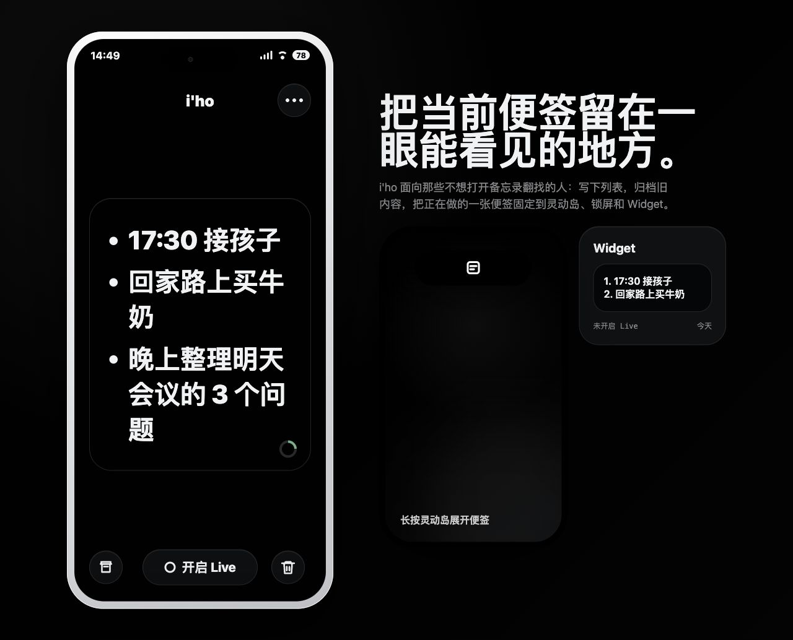

- 优点：当前便签是视觉焦点，信息层级强，挂起动作位置突出。
- 冲突：初始便签预填了内容；MVP 首次打开必须是空白、可直接输入的当前便签。
- 冲突：首页先展示排版后的预览，点击后才进入编辑；MVP 要求便签本身始终是文本编辑器。

### 2. 点击便签进入编辑态

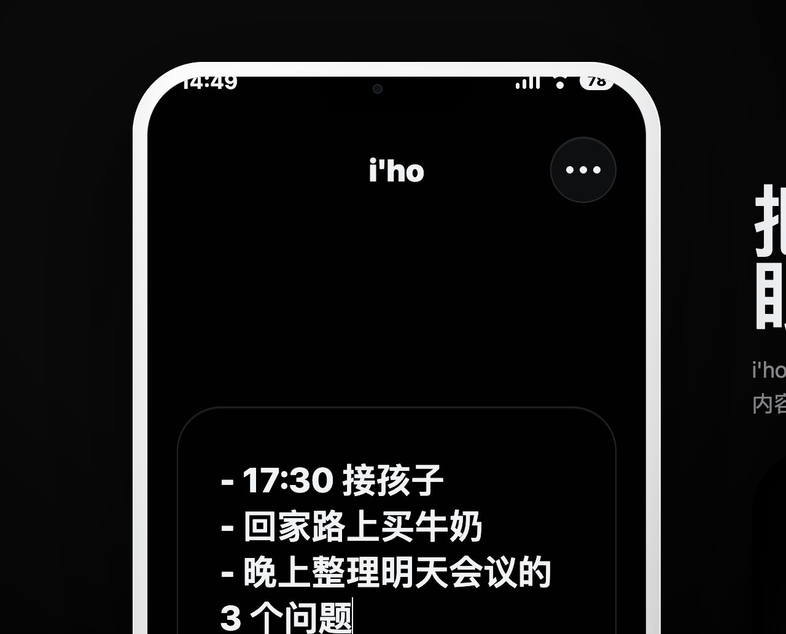

- 冲突：出现独立编辑态和 `DONE` 按钮；MVP 没有查看态/编辑态切换，也没有完成或提交动作。
- 冲突：虚拟键盘右下角应表达换行，而不是完成。
- 可见问题：退出编辑后，键盘容器仍出现在手机画面内，说明隐藏状态与布局没有彻底分离。

### 3. 输入新的多行文字

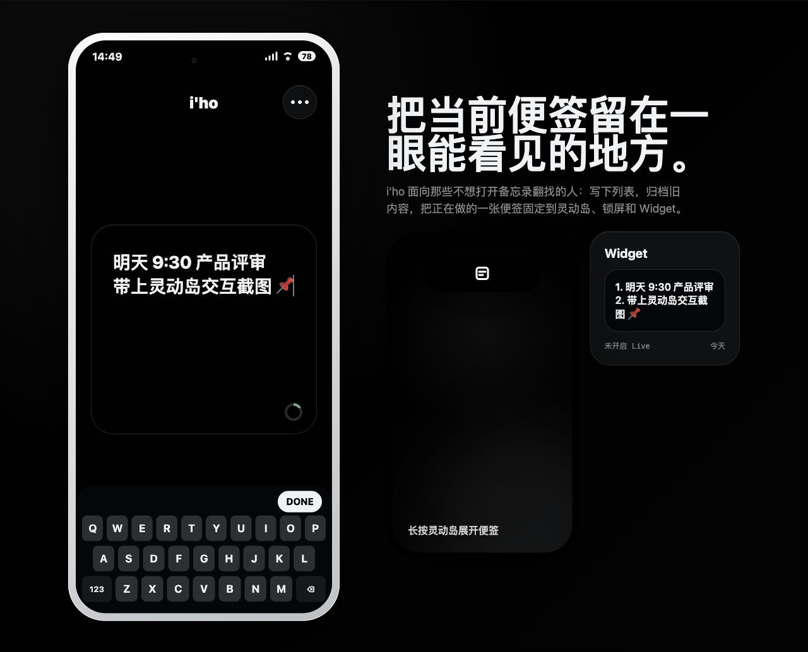

- 优点：编辑区容量和大字号便于快速确认内容。
- 冲突：以连字符或数字开头的行会被解析成列表，并在 Widget/灵动岛表面重新编号。MVP 是纯文字模型，必须原样保留换行与字符。

### 4. 开启 Live 后的说明抽屉

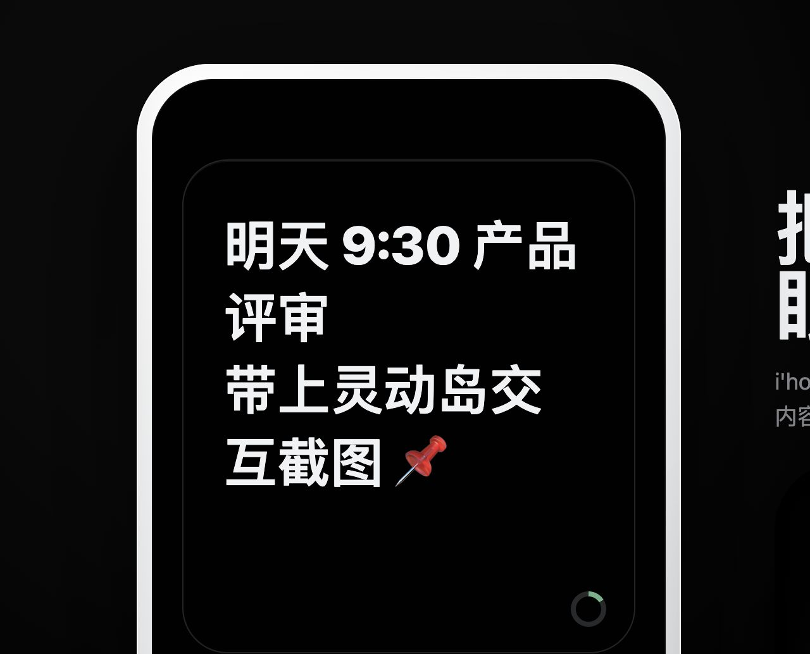

- 优点：首次解释“紧凑态只显示图标，长按后展示内容”，与已确认的灵动岛层级一致。
- 冲突：产品词汇应为“挂起 / 取消挂起”，而不是把系统实现名 `Live Activity` 当作用户主要操作词。
- 可见问题：抽屉出现时虚拟键盘仍占据画面，干扰首要说明。

### 5. Live 紧凑态

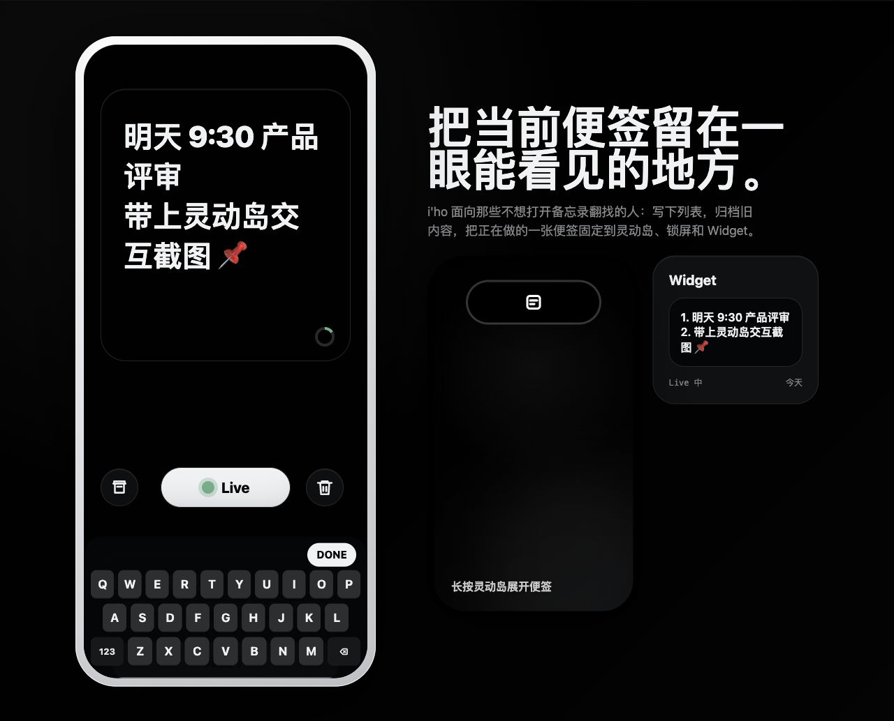

- 符合：紧凑态只显示 App/挂起标记，不露出便签正文。
- 冲突：右侧同时设计 Widget 预览，而桌面与锁屏 Widget 已明确不在 MVP 范围。

### 6. 更多菜单

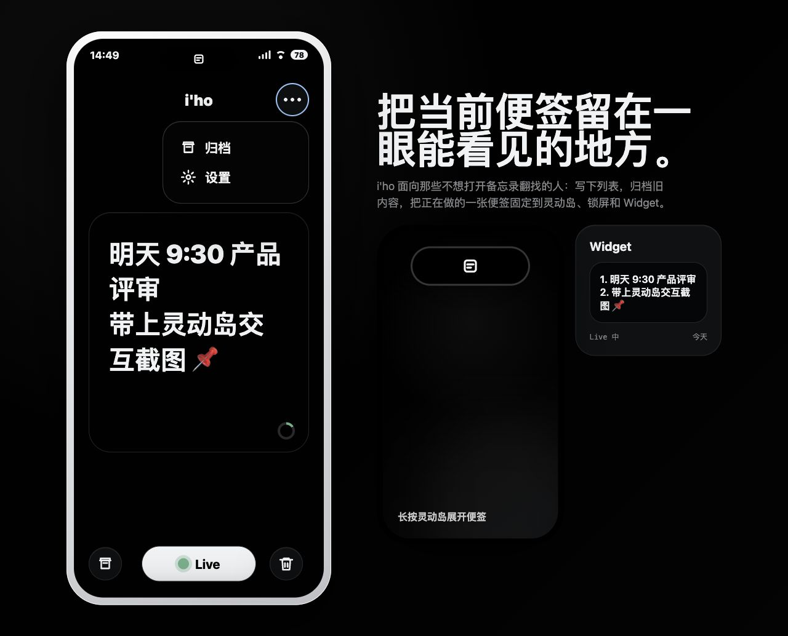

- 优点：把次要入口从当前便签工作区移开，保持单一焦点。
- 冲突：`归档` 应统一为“便签库 / 放入便签库”。
- 冲突：设置中的 Widget 和主题自定义均超出 MVP；浅色/深色是系统适配，不是用户自定义主题能力。

### 7. 便签库列表

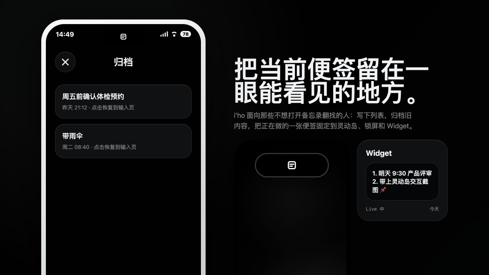

- 优点：旧便签退居次级页面，列表简单，没有搜索、标签或额外管理能力。
- 冲突：文案使用“恢复”，但实际产品规则是点击后立即与当前便签交换。
- 风险：列表项只有首行摘要，后续原型需验证多行、长文本和 VoiceOver 名称是否足以识别不同便签。

### 8. 点击旧便签后的当前页

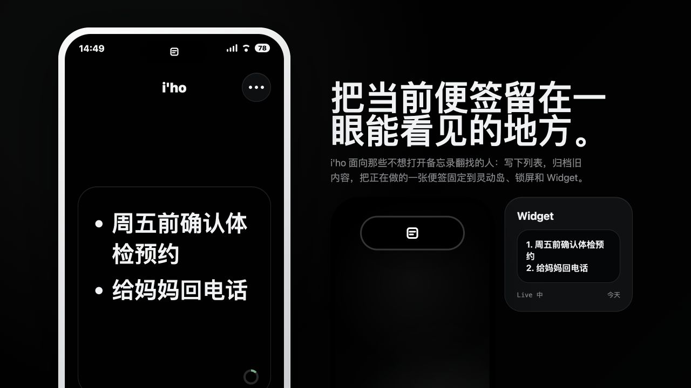

- 实测：旧便签直接覆盖当前便签；被点击的旧便签仍留在库中；原当前便签没有进入库；挂起状态仍保持。
- 严重冲突：正确规则应是双向交换。原当前便签入库并排到最上方，被选旧便签离库成为当前便签；交换前先取消挂起，新当前便签不自动挂起。

### 9. 删除后的空白页

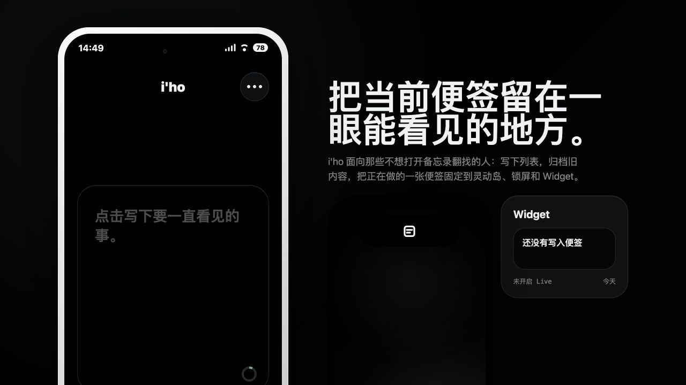

- 符合：删除后回到空白当前便签槽位。
- 严重冲突：点击删除立即清空，没有不可恢复提示和二次确认。
- 冲突：空白状态下“入库、挂起、删除”仍可点击，只通过 toast 拒绝；MVP 要求这些操作在空白或只有空白字符时明确禁用。

### 10. 设置页

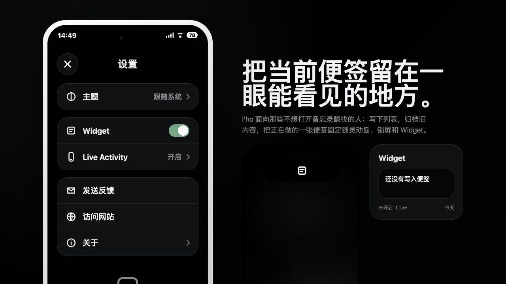

- 范围冲突：Widget、主题选择、反馈、网站和关于不是当前决策票要解决的工作台/便签库交互。
- 范围冲突：MVP 不提供主题自定义，只要求统一视觉随系统适配浅色与深色。
- 原型约束冲突：主题写入 `localStorage`，而 throwaway 原型要求内存状态、刷新重置。

### 11. 输入 241 个字符

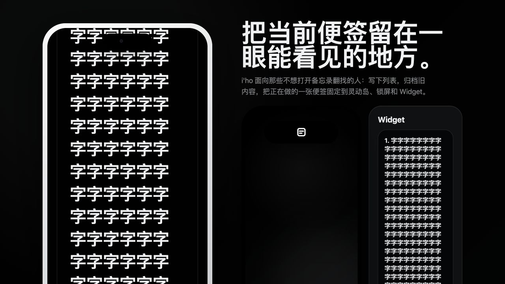

- 实测：输入框接受了 241 个汉字，`maxlength` 未设置，也没有“最多 240 个字符”提示。
- 严重冲突：应按用户感知字符计数；达到 240 后拒绝新增，粘贴时截断，仍允许删除和修改。
- 布局风险：超长内容把手机内的标题、状态栏和操作区挤出可见范围，Widget 内容也无合理截断。
- 无障碍冲突：圆环标记为 `aria-hidden`，不可点击，也不提供“已输入 / 还可输入”信息或 VoiceOver 朗读。

### 12. 长按展开测试

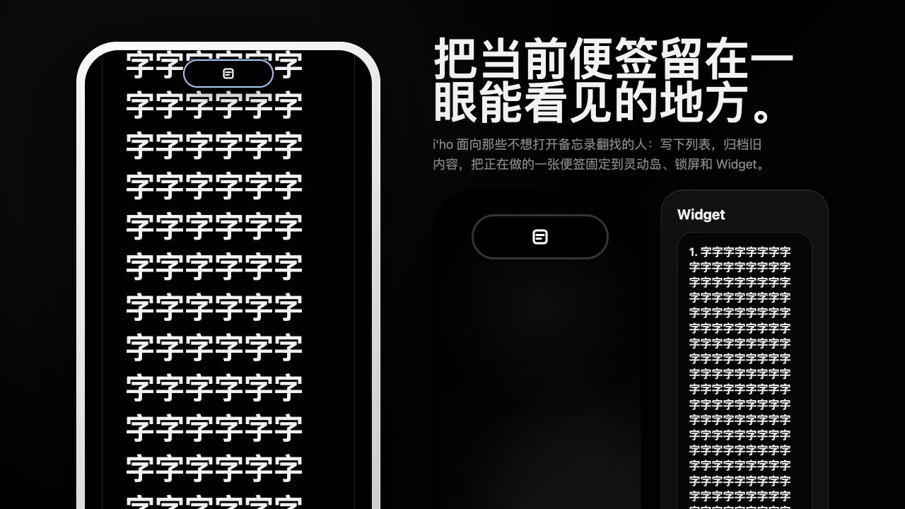

- 浏览器自动化可发送带延迟的点击，但没有形成原型要求的持续 pointer hold，页面只留下焦点轮廓，未显示展开态。
- 因此本次不把“展开态的截断、换行和再次点击返回 App”记为已验证；后续决策票必须用支持真实长按的浏览器手势或真机/模拟器补拍。

## 应保留的视觉基线

- 当前便签始终占据首页主视觉，不在首页混入历史列表。
- 黑白基础、弱绿色强调、较大字号、圆角编辑面与柔和空间层次。
- 灵动岛紧凑态只显示简洁标记，不泄露便签内容。
- 次级入口收敛，避免与编辑和挂起争夺注意力。

## 后续原型的强制纠正项

1. 首页当前便签从首次启动起就是空白常驻文本编辑器，不再区分预览态和编辑态。
2. 使用“挂起 / 取消挂起”“便签库 / 放入便签库”；不出现产品层面的 `DONE`、完成状态或“归档”。
3. 纯文字原样保留换行，不解析 Markdown、不自动编号。
4. 按用户感知字符实现 240 上限、粘贴截断、轻提示、可点击圆环和 VoiceOver 文案。
5. 空白/纯空白内容时，挂起、入库、删除必须呈现真实禁用状态。
6. 删除前二次确认，并明确删除后不可恢复。
7. 点击旧便签立即完成交换；原当前便签入库置顶，被选旧便签离库；交换先取消挂起，新便签不自动挂起。
8. 移除 Widget 和主题自定义；只验证系统浅色/深色适配。
9. throwaway 原型不使用持久化，刷新后状态重置。
10. 对每个候选方案用同一状态序列截图，提供“现有基线—候选方案”对照矩阵，由用户亲自选择。

## 无障碍风险与证据限制

- 截图可确认部分文字对比、层级和目标尺寸风险，但不能证明 WCAG 或 iOS Accessibility 合规。
- 源码和 DOM 可确认圆环被隐藏于辅助技术、删除无对话框、按钮未禁用；VoiceOver 实际朗读、焦点顺序和动态状态播报仍需在 iOS 模拟器或真机验证。
- 这是桌面浏览器中的手机外观原型，不能验证真实 Dynamic Island、锁屏 Live Activity、系统键盘或系统授权行为。
- 长按展开态本次未成功触发，已作为具名验证缺口保留。

## 2026-07-31 复跑核验（任务 `019fb7dd`）

本次通过本地 HTTP 服务和 in-app Browser，在 `390 × 844` 视口重新执行了初始页、编辑、多行与组合 Emoji、开启 Live、紧凑态、更多菜单、便签库、点击旧便签、设置、241 字符、删除与长按尝试。证据保存在 [`rerun-019fb7dd/`](rerun-019fb7dd/)；每张截图均在保存后重新打开检查，错误视口截图已拒绝并重拍。

实测行为与本报告原结论一致：旧便签会覆盖当前便签且继续保持 Live，被点击旧便签不会离库，原当前便签不会入库；输入框接受 241 个汉字且 `maxLength` 未设置；删除在关闭遮挡抽屉后立即清空，没有确认；设置仍含 Widget、主题选择及其他越界入口。移动端视口还再次暴露了隐藏虚拟键盘和说明抽屉参与布局、页面在工作台与右侧营销预览之间发生纵向跳动的问题。

| 类别 | 本次结论 |
| --- | --- |
| 保留的视觉语言 | 黑白主色、弱绿色挂起强调、大号粗体、圆角纸张表面、柔和层次；首页只聚焦当前便签；次级入口收敛；灵动岛紧凑态不显示正文。 |
| 必须纠正的产品行为 | 常驻编辑器；使用“挂起 / 取消挂起”“便签库 / 放入便签库”；纯文字原样保留；240 个用户感知字符上限；空白操作真实禁用；删除二次确认；旧便签双向交换并取消挂起；移除 Widget、主题自定义与持久化；修复窄屏布局和隐藏面板占位。 |
| 本次无法验证的缺口 | in-app Browser 的 drag 只留下焦点轮廓，没有形成持续 `pointerdown` 超过 520 ms，因此没有触发灵动岛展开态；未通过改 class、调用页面函数或篡改状态伪造该状态。VoiceOver 实际朗读、真实系统键盘、Dynamic Island、锁屏与真机行为仍需后续验证。 |
